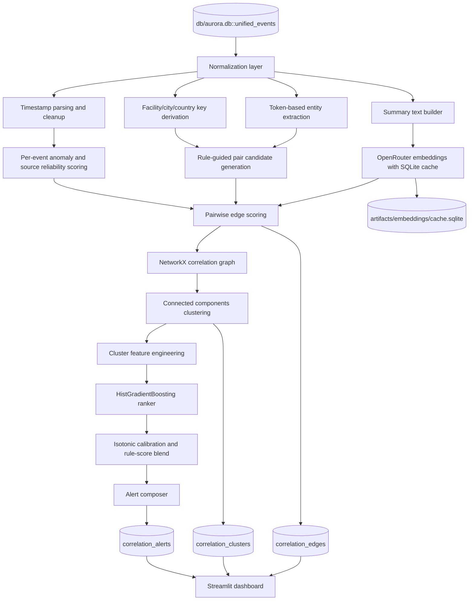

# Cyber-Physical Correlation Engine - Implementation

This document describes the correlation engine that is actually implemented in
this repo. 

The current system is:

- SQLite-backed
- rule-guided
- embedding-assisted
- graph-based
- ranked with scikit-learn

## 1. Starting Point

The engine starts from the master database:

- `db/aurora.db`

The main input table is:

- `unified_events`

That table is created by:

- `scripts/build_aurora_db.py`

The DB build step performs light cleanup and exact deduplication, then writes
the unified records into SQLite.

## 2. Actual Architecture

### High-level summary

The current engine follows this flow:

1. read `unified_events` from `aurora.db`
2. normalize timestamps and key text fields
3. derive simple location keys and token-based entities
4. compute per-event anomaly and source reliability scores
5. build event summary text
6. compute OpenRouter embeddings with a local SQLite cache
7. score event pairs using time, location, entity overlap, type compatibility, semantic similarity, and anomaly support
8. build a graph of related events
9. convert connected components into candidate incident clusters
10. featurize clusters
11. rank clusters with scikit-learn's `HistGradientBoostingClassifier`
12. calibrate confidence with isotonic regression and blend with rule score
13. compose alerts and write results back to SQLite
14. display the outputs in Streamlit

### Mermaid view

## 3. Implementation

- mixed-format timestamp parsing and normalization to UTC
- boolean and severity normalization
- exact deduplication during DB build
- simple text-based location normalization
- token-based entity extraction
- per-event anomaly scoring
- source reliability scoring
- OpenRouter embedding calls
- local embedding cache in SQLite
- rule-guided pair scoring
- sparse graph construction with NetworkX
- connected-components cluster discovery
- cluster feature engineering
- scikit-learn ranking with calibration
- optional LLM alert phrasing through OpenRouter
- SQLite writeback tables
- Streamlit dashboard

## 4. Detailed Behavior by Component

### A. Input and normalization

Source table:

- `unified_events`

Core normalization behavior:

- parse `timestamp` with mixed-format support and convert to UTC
- normalize booleans such as `is_live` and `is_simulated`
- convert severity-like values into numeric scores
- derive normalized text keys for:
  - `facility`
  - `city`
  - `country`
- extract token-based entities from:
  - facility
  - city
  - country
  - tags
  - vulnerability
  - technique ID
  - risk fields
  - infrastructure type
  - event type
  - title
  - description
- build one summary text per event for embedding

Important limitation:

- location handling is text-based only
- there is no lat/lon enrichment
- there is no H3 cell computation

### B. DB build and deduplication

The DB build step in `scripts/build_aurora_db.py` does:

- source-specific column mapping
- light string cleanup
- exact deduplication by:
  - `event_id`
  - `source`
  - `timestamp`
  - `title`

Important limitation:

- deduplication is exact-key based only
- near-duplicate events from different feeds are not merged semantically

### C. Event-level scoring

Each event gets two main scores before cross-event correlation:

1. `source_reliability`
2. `domain_anomaly_score`

`source_reliability` is currently heuristic and source-based. For example:

- `SIM` is treated as highest reliability
- `CISA_ICS` and `CISA_KEV` are strong
- `AIID` is moderate
- `GDELT` is weaker

`domain_anomaly_score` is based on:

- normalized severity
- event-type rarity
- live/simulated flags
- physical consequence flag
- critical service impact flag
- malicious intent flag
- source reliability

### D. Embeddings

Embeddings are generated from summary text like:

- domain
- source
- event type
- normalized location
- infrastructure context
- risk fields
- extracted entities
- title and description

The implementation uses:

- OpenRouter embeddings
- default model: `openai/text-embedding-3-small`

Embeddings are cached locally in:

- `artifacts/embeddings/cache.sqlite`

There are no local model downloads and no sentence-transformer weights in the
active path.

### E. Pairwise correlation logic

The engine does not compare every event equally. It first uses simple anchors:

- time closeness
- shared facility
- shared city and country
- shared country
- shared sector or infrastructure type
- entity overlap
- compatible event-type combinations

Examples of hardcoded type compatibility boosts:

- `port_scan` with `auth_failure`
- `auth_failure` with `badge_anomaly`
- `badge_anomaly` with `news_report`

Then it computes a final edge score using:

- time score
- location score
- semantic similarity
- entity overlap
- anomaly support
- compatibility score
- source diversity bonus

Only pairs above the configured threshold become graph edges.

### F. Graph and clusters

The graph uses:

- nodes: events
- edges: sufficiently strong event-event correlations

The current implementation does **not** create separate graph nodes for:

- facilities
- organizations
- IPs
- devices

Clustering uses:

- connected components in NetworkX

This gives a simple, explainable grouping of related events into candidate
incidents.

### G. Cluster features

Each cluster is converted into a feature vector including:

- number of events
- number of live events
- number of unique domains
- number of unique sources
- mean and max anomaly
- mean and max edge weight
- temporal spread in minutes
- location focus
- facility share
- source reliability mean and minimum
- critical asset count
- event type diversity
- OSINT report count

### H. Ranking and confidence

The current ranker is:

- scikit-learn `HistGradientBoostingClassifier`

Labeling for this ranker is currently weakly supervised:

- strong live multi-domain clusters are treated as positives
- low-signal or single-domain weak clusters become negatives

Confidence is then calibrated using:

- isotonic regression

Final alert score is:

- `0.7 * model_confidence + 0.3 * rule_score`

Priority bands are then assigned from that final score.

### I. Alert composition

Each alert includes:

- `alert_id`
- `cluster_id`
- `priority`
- `confidence`
- time window
- location
- headline
- `why_it_matters`
- `next_actions`
- evidence list
- supporting prior incidents/context

The alert payload is assembled deterministically first.

If OpenRouter chat is available, the system optionally improves the wording of:

- headline
- why-it-matters bullets
- next-actions bullets
- analyst notes

If the LLM call fails, the deterministic alert still stands.

## 5. Output Tables

When the engine runs with writeback enabled, it writes:

- `correlation_edges`
- `correlation_clusters`
- `correlation_alerts`

into the same SQLite database:

- `db/aurora.db`

This means the dashboard reads persisted correlation results, not just in-memory
objects.

## 6. Dashboard

The current UI is a Streamlit dashboard that shows:

- active alerts
- alert queue
- correlated clusters
- edge feed
- live signals

It can also trigger a fresh engine run from the sidebar.

## 7. Current Repo Components

The main implementation files are:

- `scripts/build_aurora_db.py`
- `scripts/run_correlation_engine.py`
- `correlation_engine/engine.py`
- `correlation_engine/runtime.py`
- `openai_embeddings.py`
- `openai_model.py`
- `dashboard.py`

## 8. Practical Interpretation

The current engine should be understood as:

- a practical prototype
- good for showing correlation logic end to end
- explainable enough for demos
- intentionally simpler than the original aspirational design

The biggest simplifications compared with the earlier concept are:

- text-based location matching instead of geospatial indexing
- token extraction instead of full entity resolution
- connected components instead of richer graph community methods
- scikit-learn ranker instead of XGBoost

## 9. Suggested Next Improvements

If the team wants to extend the current implementation, the highest-value next
steps are:

1. add real geocoding and latitude/longitude fields
2. add H3 indexing once coordinates exist
3. improve deduplication beyond exact-key matching
4. move from token extraction to stronger entity resolution
5. add richer historical labeling for the ranker
6. add a proper replay or streaming ingestion layer

## 10. Bottom Line

The current architecture in this repo is best described as:

- master SQLite event store
- lightweight normalization
- OpenRouter embedding enrichment
- rule-guided pair scoring
- NetworkX clustering
- scikit-learn ranking and calibration
- SQLite writeback
- Streamlit dashboard

That is the real implemented system today.
