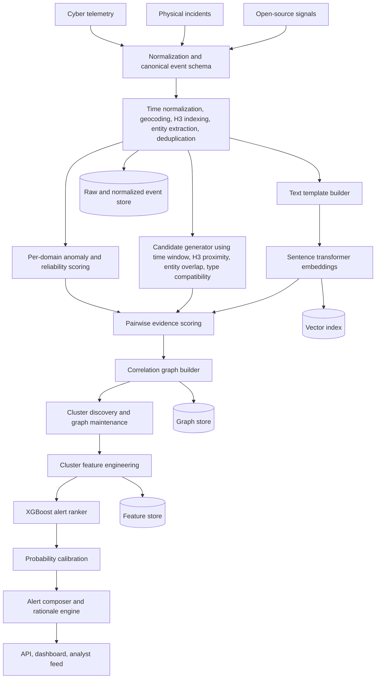

# Cyber-Physical Correlation Engine - Option A

## Hybrid design: rules + embeddings + graph + XGBoost

This README describes a practical implementation roadmap for the hackathon. It assumes the data is already available and the team can focus on normalization, correlation logic, scoring, and alert generation.

## 1. Objective

Build a near-real-time engine that correlates cyber telemetry, physical incident logs, and open-source signals to surface potentially coordinated activity early enough for a human analyst to investigate.

The engine should answer four questions for every alert:

1. What happened?
2. Why do these signals look connected?
3. How confident is the system?
4. What should an analyst check next?

## 2. Why this architecture

Option A is the best hackathon choice because it balances accuracy, speed, and explainability.

- **Rules** give fast, high-recall candidate generation.
- **Embeddings** align cyber, physical, and OSINT events even when wording differs.
- **Graph correlation** captures multi-hop relationships across events, entities, assets, and locations.
- **XGBoost** ranks correlated clusters into analyst-worthy alerts and gives strong performance on tabular features.

This design is strong even if labels are limited, and it is much easier to explain to judges than an end-to-end black box.

## 3. Reference architecture

A rendered architecture diagram is included separately in this folder as `optionA_correlation_architecture.svg` and `optionA_correlation_architecture.png`.

### Mermaid version



## 4. End-to-end flow

### Stage 1: Normalize every event into one schema

Each input event, regardless of source, must be converted into a common representation.

Suggested canonical schema:

```json
{
  "event_id": "string",
  "domain": "cyber | physical | osint",
  "source_name": "vendor_or_feed_name",
  "event_type": "network_scan | outage | access_violation | social_report | ...",
  "event_subtype": "string",
  "ts_start": "ISO-8601 timestamp",
  "ts_end": "ISO-8601 timestamp or null",
  "lat": 0.0,
  "lon": 0.0,
  "h3_cell": "string",
  "location_text": "string",
  "facility_id": "string or null",
  "asset_id": "string or null",
  "entities": ["substation-7", "acme-hospital", "10.1.2.4"],
  "severity": 0.0,
  "source_reliability": 0.0,
  "raw_text": "original text or generated text summary",
  "structured_fields": {},
  "domain_anomaly_score": 0.0
}
```

Core normalization tasks:

- convert timestamps to one timezone and UTC
- geocode or map location strings to coordinates
- compute H3 cells at one or two resolutions
- extract named entities, assets, IOCs, and facility names
- deduplicate repeated messages or duplicate feeds
- create a short textual representation for embedding

### Stage 2: Score each stream independently

Before cross-domain fusion, assign a stream-level score that answers: "how unusual is this event inside its own domain?"

Examples:

- cyber: unusual auth burst, scanning activity, OT protocol anomaly
- physical: abnormal badge access, unusual incident concentration, outage spike
- osint: source credibility, burstiness, topic novelty, repeated mentions near same place

These scores do not create alerts by themselves. They become evidence later.

### Stage 3: Generate high-recall correlation candidates

For every new event, retrieve nearby events using a short time window and spatial index.

Candidate rules:

- within `+/- 30 to 60 minutes`
- within same H3 cell or neighboring cells
- direct entity or facility overlap
- compatible event types, such as `network_scan` with `substation_access_alert`
- source diversity bonus if at least two domains are present

This step should optimize for **recall**, not final precision. Keep the threshold loose.

### Stage 4: Add semantic evidence with embeddings

Many correlated events will not share exact words. Convert normalized text into embeddings and compute semantic similarity.

Recommended starting models:

- `sentence-transformers/all-MiniLM-L6-v2` for speed
- `BAAI/bge-small-en-v1.5` if you want stronger retrieval
- `intfloat/e5-base-v2` if you want balanced quality and cost

Text template used for embedding:

```text
Domain: cyber
Type: network_scan
Location: substation 7, Springfield
Entities: gateway-12, rtus, 10.1.2.4
Summary: repeated failed connections against substation control gateway
```

Use the embedding only as one signal. It should never override time and location entirely.

### Stage 5: Build the correlation graph

Represent the world as a graph.

**Nodes**

- normalized events
- facilities
- assets
- organizations
- IPs, devices, users, or vehicles when available
- locations or H3 cells

**Edges**

- temporal proximity
- spatial proximity
- entity overlap
- facility overlap
- semantic similarity
- domain compatibility
- source corroboration

A simple pairwise edge score works well:

```text
edge_score =
    0.30 * time_decay(delta_t)
  + 0.25 * geo_decay(distance_km)
  + 0.20 * semantic_similarity
  + 0.15 * entity_overlap
  + 0.10 * anomaly_support
```

Only keep edges above a minimum threshold. This keeps the graph sparse and easier to explain.

### Stage 6: Discover correlated clusters

Run one of the following on a rolling graph window:

- connected components for a fast baseline
- Louvain or Leiden for denser graphs
- label propagation if you want a very light community method

Each cluster is now a candidate correlated incident.

### Stage 7: Convert clusters into model features

This is the key bridge between graph correlation and XGBoost.

Suggested cluster features:

- number of events
- number of unique domains
- number of unique sources
- max and mean domain anomaly score
- max and mean semantic similarity
- max and mean edge weight
- cluster temporal spread in minutes
- cluster geographic spread in km
- fraction of events tied to same facility
- source reliability mean and minimum
- count of critical assets involved
- event type diversity
- novelty versus historical baseline
- number of corroborating OSINT reports

### Stage 8: Rank candidate clusters with XGBoost

Use XGBoost to estimate whether a cluster deserves analyst attention.

Why XGBoost is the right final model:

- excellent on mixed numerical and categorical engineered features
- robust with limited data
- fast to train and infer
- easy to inspect with feature importance and SHAP

Target label choices:

- `1 = worthy of analyst escalation`
- `0 = noise / unrelated coincidence`

If labeled data is scarce, start with weak supervision:

- auto-generate positives from simulated coordinated scenarios
- auto-generate negatives from random co-occurrences
- let analysts review top-ranked clusters and refine labels

### Stage 9: Calibrate confidence

Do not expose raw XGBoost scores directly as confidence.

Use:

- Platt scaling, or
- isotonic regression

Then apply guardrails:

- downgrade confidence when only one domain is present
- downgrade confidence when spatial accuracy is poor
- downgrade confidence when source reliability is weak
- upgrade confidence when multiple independent sources corroborate the same facility and time window

### Stage 10: Generate the alert narrative

Every alert needs a compact explanation.

Suggested output contract:

```json
{
  "alert_id": "ALERT-00124",
  "priority": "high",
  "confidence": 0.82,
  "time_window": "2026-04-18T14:05:00Z to 2026-04-18T14:27:00Z",
  "location": "Substation 7, Springfield",
  "headline": "Potential coordinated cyber-physical activity near Substation 7",
  "why_it_matters": [
    "Cyber scan activity and physical access anomaly occurred within 18 minutes",
    "Two signals map to the same facility and adjacent H3 cells",
    "OSINT posts mention localized power disruption in the same area"
  ],
  "evidence": [
    {"event_id": "cy-991", "domain": "cyber", "score": 0.77},
    {"event_id": "ph-112", "domain": "physical", "score": 0.74},
    {"event_id": "os-443", "domain": "osint", "score": 0.63}
  ],
  "next_actions": [
    "Validate gateway and RTU logs for Substation 7",
    "Check camera and badge records near the affected perimeter",
    "Verify whether outage reports align with maintenance activity"
  ]
}
```

## 5. Detailed component design

### A. Input adapters

Each source gets a thin adapter that maps raw records into the canonical schema.

Examples:

- `cyber_adapter.py`
- `physical_adapter.py`
- `osint_adapter.py`

Output should always be a normalized event object and should never contain downstream model logic.

### B. Indexing strategy

Because the system is real time, indexing is critical.

Use:

- H3 for spatial lookup
- sorted timestamp index for sliding windows
- vector index for embedding search if needed
- event-id cache for deduplication

### C. Graph maintenance strategy

Maintain a rolling graph window, for example last 6 or 12 hours. Expire old nodes and edges to keep latency low.

### D. Explanation strategy

Use three explanation sources:

1. dominant graph edges
2. top XGBoost features from SHAP
3. rule triggers that created the cluster

This gives highly interpretable alerts.

## 6. Offline versus online pipeline

### Offline pipeline

Use this for training and tuning.

1. normalize historical events
2. compute embeddings
3. generate pair candidates
4. build historical clusters
5. derive cluster features
6. train XGBoost
7. calibrate probabilities
8. store thresholds and model artifacts

### Online pipeline

Use this for demo and near-real-time scoring.

1. receive new event
2. normalize and score inside its domain
3. retrieve spatiotemporal neighbors
4. compute semantic and rule-based pair scores
5. update graph
6. update cluster features
7. run ranker on new or changed clusters
8. emit alert if threshold is exceeded

## 7. Suggested repository structure

```text
correlation-engine/
├── README.md
├── configs/
│   ├── pipeline.yaml
│   ├── thresholds.yaml
│   └── feature_flags.yaml
├── data/
│   ├── raw/
│   ├── normalized/
│   ├── features/
│   └── labels/
├── notebooks/
│   ├── 01_schema_validation.ipynb
│   ├── 02_embedding_quality.ipynb
│   ├── 03_graph_experiments.ipynb
│   └── 04_model_eval.ipynb
├── src/
│   ├── adapters/
│   │   ├── cyber_adapter.py
│   │   ├── physical_adapter.py
│   │   └── osint_adapter.py
│   ├── normalization/
│   │   ├── schema.py
│   │   ├── geo.py
│   │   ├── time_utils.py
│   │   ├── dedupe.py
│   │   └── entities.py
│   ├── scoring/
│   │   ├── cyber_anomaly.py
│   │   ├── physical_anomaly.py
│   │   ├── osint_reliability.py
│   │   └── pairwise_score.py
│   ├── embeddings/
│   │   ├── encode.py
│   │   └── similarity.py
│   ├── graph/
│   │   ├── builder.py
│   │   ├── clustering.py
│   │   └── features.py
│   ├── models/
│   │   ├── train_ranker.py
│   │   ├── infer_ranker.py
│   │   ├── calibrate.py
│   │   └── explain.py
│   ├── serving/
│   │   ├── stream_processor.py
│   │   ├── alert_builder.py
│   │   └── api.py
│   └── utils/
│       └── logging.py
├── artifacts/
│   ├── encoders/
│   ├── xgb/
│   └── calibrators/
└── tests/
    ├── test_normalization.py
    ├── test_pairwise_score.py
    ├── test_graph_features.py
    └── test_alert_builder.py
```

## 8. Step-by-step implementation roadmap

This is the most important section for the hackathon.

### Step 0: Lock the problem contract

**Goal**: agree on exactly what the system must emit.

Deliverables:

- canonical alert JSON schema
- target latency goal, for example under 5 seconds per event batch
- evaluation plan and success criteria

Acceptance criteria:

- everyone on the team agrees what counts as a good alert

### Step 1: Build the canonical event schema

**Goal**: every source should map to one event object.

Tasks:

- map columns from cyber, physical, and OSINT datasets
- normalize time fields
- normalize locations and compute H3
- define event types and subtypes
- create `raw_text` or `summary_text` for every event

Deliverables:

- `schema.py`
- three source adapters
- one normalized dataset for each source

Acceptance criteria:

- 95 percent or more of records can be converted into the canonical schema
- key fields like time and location are populated for most records

### Step 2: Implement the baseline rule engine

**Goal**: create a fast candidate generator with high recall.

Tasks:

- sliding time window retrieval
- H3 or radius-based spatial retrieval
- simple entity overlap checks
- event-type compatibility map
- pairwise rule score

Deliverables:

- `pairwise_score.py`
- config file with thresholds

Acceptance criteria:

- a synthetic coordinated scenario produces candidate pairs
- the candidate generator returns results in milliseconds to low seconds

### Step 3: Add per-domain anomaly and reliability scoring

**Goal**: each event carries domain-specific evidence before fusion.

Tasks:

- cyber anomaly score from features already available in telemetry
- physical anomaly score from incident rarity or rule severity
- OSINT reliability score based on source quality, burstiness, and repetition

Deliverables:

- one score per event stored in normalized output

Acceptance criteria:

- anomalous simulated events are ranked above normal background events

### Step 4: Add embeddings for semantic alignment

**Goal**: connect events that describe the same situation differently.

Tasks:

- design text template for each event
- encode all events
- compute pairwise semantic similarity for candidate pairs
- evaluate whether similar incidents score high and unrelated events score low

Deliverables:

- embedding encoder module
- offline embedding cache

Acceptance criteria:

- related cross-domain descriptions are closer than unrelated ones in sample tests

### Step 5: Build the rolling correlation graph

**Goal**: move from isolated pairs to correlated incidents.

Tasks:

- add event nodes and optional facility/entity nodes
- add weighted edges for time, geo, semantic, and entity similarity
- maintain graph over rolling time window
- compute clusters using connected components first

Deliverables:

- graph builder
- cluster generator

Acceptance criteria:

- synthetic multi-signal incidents appear as coherent clusters

### Step 6: Engineer cluster-level features

**Goal**: transform each cluster into a model-ready feature vector.

Tasks:

- aggregate counts, max scores, spreads, diversity, criticality
- store feature vectors and labels
- verify features are stable and interpretable

Deliverables:

- `features.py`
- feature schema documentation

Acceptance criteria:

- each cluster can be converted into a fixed-length vector with no missing critical fields

### Step 7: Train the XGBoost alert ranker

**Goal**: learn which clusters deserve analyst attention.

Tasks:

- prepare labeled or weakly labeled training set
- train XGBoost classifier or ranker
- tune thresholds for precision-recall tradeoff
- inspect feature importance

Deliverables:

- trained model artifact
- baseline metrics report

Acceptance criteria:

- top-ranked alerts clearly outperform rules-only baseline

### Step 8: Calibrate confidence and add explanations

**Goal**: make scores trustworthy and analyst-friendly.

Tasks:

- apply probability calibration
- add confidence adjustment rules
- generate rationale from graph edges and SHAP features
- generate recommended analyst next actions

Deliverables:

- `calibrate.py`
- `explain.py`
- alert composer

Acceptance criteria:

- every alert includes confidence and at least 2 to 3 clear reasons

### Step 9: Build the demo pipeline

**Goal**: make the end-to-end system visible.

Tasks:

- run events through a replay stream or micro-batches
- display correlated cluster timeline and alert cards
- show why the alert fired
- show confidence and top evidence

Deliverables:

- simple API or dashboard
- replay script for judge demo

Acceptance criteria:

- the demo reliably produces one strong alert from a known scenario

### Step 10: Evaluate and harden

**Goal**: make the story credible.

Tasks:

- compare rules-only versus full hybrid system
- measure alert precision at top K
- measure detection latency
- test ablations by removing embeddings or graph or XGBoost

Deliverables:

- evaluation notebook or slide-ready summary

Acceptance criteria:

- you can clearly explain why each module adds value

## 9. Recommended implementation order for a short hackathon

If time is tight, follow this exact order.

### Must-have path

1. canonical schema
2. rule-based candidate generation
3. graph clustering with connected components
4. simple cluster feature engineering
5. XGBoost ranker
6. alert narrative

### Strong upgrade path

7. sentence embeddings
8. confidence calibration
9. SHAP explanation

### Nice-to-have path

10. better anomaly models
11. Louvain or Leiden clustering
12. vector index for faster semantic retrieval

## 10. Feature table for the final XGBoost model

| Feature | Description |
|---|---|
| `cluster_event_count` | Total number of events in the cluster |
| `cluster_domain_count` | Count of unique domains |
| `cluster_source_count` | Count of unique feeds or systems |
| `max_domain_anomaly` | Maximum anomaly score among member events |
| `mean_domain_anomaly` | Average anomaly score among member events |
| `max_edge_score` | Strongest pairwise relation in the cluster |
| `mean_edge_score` | Average relation strength |
| `mean_semantic_similarity` | Average text similarity |
| `entity_overlap_ratio` | Degree of shared entities or facilities |
| `temporal_spread_minutes` | Time range of the cluster |
| `geo_spread_km` | Spatial dispersion |
| `critical_asset_count` | Count of critical facilities involved |
| `osint_corroboration_count` | Number of supporting OSINT signals |
| `source_reliability_mean` | Average source trust score |
| `same_facility_fraction` | Fraction of events mapped to same facility |
| `event_type_diversity` | Diversity of event categories |
| `novelty_score` | Deviation from recent baseline |

## 11. Evaluation metrics

Track both model quality and operational quality.

### Correlation quality

- precision at top K alerts
- recall on simulated coordinated scenarios
- false positive rate per hour
- area under precision-recall curve

### Operational quality

- time from event arrival to alert
- alert explanation completeness
- average number of evidence items per alert
- percentage of alerts with at least 2 domains represented

## 12. Minimal pseudocode

```python
for event in stream:
    e = normalize(event)
    e.domain_anomaly_score = score_in_domain(e)

    candidates = retrieve_candidates(
        time_window=e.ts_start,
        h3_cell=e.h3_cell,
        entities=e.entities,
    )

    for c in candidates:
        sim = semantic_similarity(e, c)
        edge_score = pairwise_score(e, c, sim)
        if edge_score >= EDGE_THRESHOLD:
            graph.add_edge(e.event_id, c.event_id, weight=edge_score)

    cluster_ids = update_clusters(graph, new_event=e.event_id)

    for cluster_id in cluster_ids:
        features = featurize_cluster(graph, cluster_id)
        raw_p = xgb.predict_proba(features)[1]
        conf = calibrator(raw_p)
        alert = build_alert(cluster_id, conf, graph)
        if conf >= ALERT_THRESHOLD:
            emit(alert)
```

## 13. Suggested libraries

- pandas or polars for data processing
- pydantic for schema validation
- h3 for geospatial indexing
- sentence-transformers for embeddings
- scikit-learn for calibration and baselines
- xgboost for final ranker
- networkx for prototype graph logic
- igraph if you need more speed
- shap for explanation
- FastAPI or Streamlit for demo

## 14. Risks and mitigations

### Risk: too many false positives

Mitigation:

- require at least two independent evidence types for medium or high confidence
- calibrate confidence
- add source reliability weighting
- enforce geographic and temporal consistency

### Risk: weak labels

Mitigation:

- use synthetic or weak supervision
- build scenarios and negative samples explicitly
- focus on ranking rather than binary truth claims

### Risk: graph becomes too dense

Mitigation:

- keep strong edge thresholds
- maintain rolling windows
- restrict semantic comparisons to candidate pairs only

## 15. What to show judges

A strong demo sequence is:

1. replay one cyber event
2. replay one physical event nearby
3. replay one supporting OSINT signal
4. show the graph cluster forming
5. show the alert score rising
6. emit the final alert card with rationale and confidence

That story makes the architecture intuitive and operational.

## 16. Final recommendation

If the team has limited time, do not overcomplicate the anomaly models. The core differentiator is the fusion logic.

The best hackathon deliverable is:

- reliable normalization
- strong spatiotemporal candidate generation
- embeddings for semantic lift
- graph clustering for multi-signal context
- XGBoost for final alert ranking
- concise alert explanations

That combination is feasible, explainable, and likely to score well.
